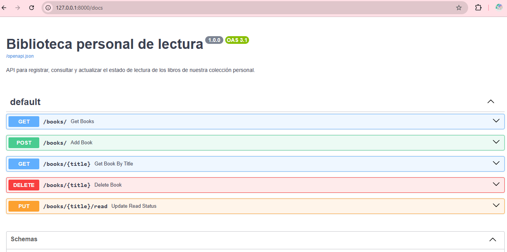
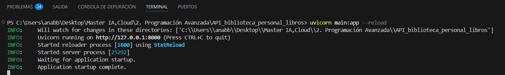
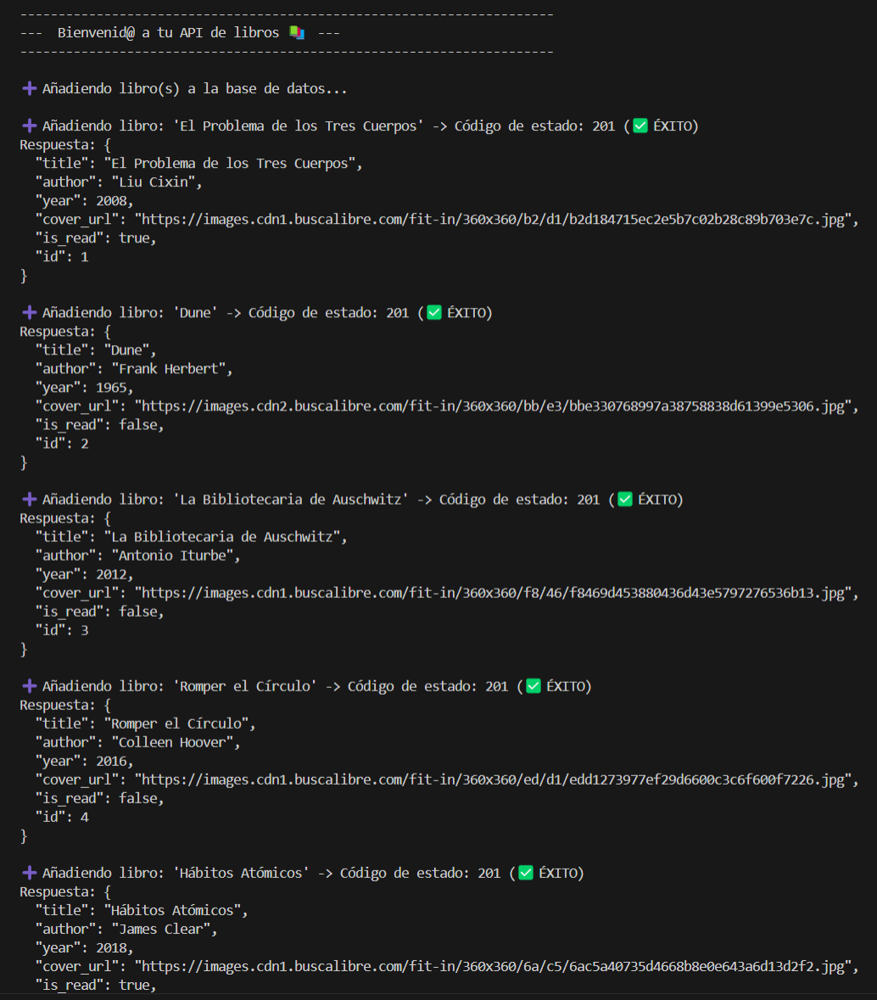
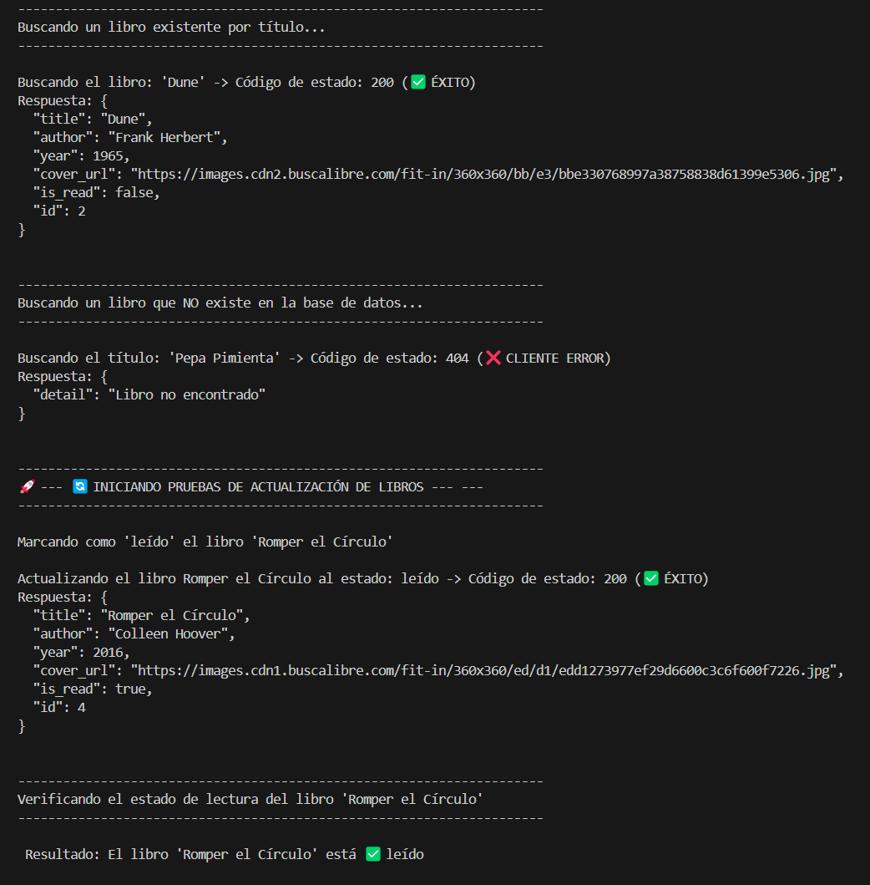

# 📚 Biblioteca Personal de Libros

API desarrollada con **FastAPI** para gestionar una colección personal de libros.
Permite a los usuarios registrar, consultar, actualizar y eliminar libros, además de controlar su estado de lectura.

---

## 🚀 Características

* **Registro Completo de Libros**: Cada libro se registra con `título`, `autor`, `año de publicación`, `URL de la portada` y un estado inicial `is_read` (leído/no leído).
* **Gestión de Colección**:
    * **Añadir Libros**: `POST /books/`
    * **Consultar Todos los Libros**: `GET /books/`
    * **Buscar Libro por Título**: `GET /books/{title}`
    * **Actualizar Estado de Lectura**: `PUT /books/{title}` para marcar un libro como leído o no leído.
    * **Eliminar Libro por Título**: `DELETE /books/{title}`
* **Validación de Duplicados**: Evita la adición de libros con títulos ya existentes, devolviendo un código de estado `409 CONFLICT`.
* **Respuestas HTTP**: Todos los endpoints devuelven códigos de estado HTTP apropiados para cada operación:
    * `200 OK`: Petición exitosa (GET, PUT, DELETE)
    * `201 CREATED`: Recurso creado exitosamente (POST)
    * `404 NOT FOUND`: Recurso no encontrado
    * `409 CONFLICT`: Conflicto, usualmente por un recurso duplicado

---

## 🖼️ Vista de la API en funcionamiento



---

## 🧪 Script de pruebas

El script `test_requests.py` realiza peticiones HTTP para:

- Añadir varios libros (`POST`)
- Consultar todos los libros (`GET`)
- Consultar un libro por título (`GET`)
- Eliminar un libro (`DELETE`)
- Actualizar el estado de lectura (`PUT`)

---

## 🛠️ Tecnologías utilizadas

* **Python 3.x**: Lenguaje de programación.
* **FastAPI**: Framework web moderno y rápido para construir APIs.
* **Pydantic**: Biblioteca para validación y serialización de datos con `BaseModel`.
* **SQLAlchemy**: ORM (Object-Relational Mapper) para interactuar con la base de datos de manera relacional.
* **SQLite**: Base de datos ligera utilizada para la persistencia de datos (`sql_app.db`).
* **Uvicorn**: Servidor ASGI para ejecutar la aplicación FastAPI.
* **Requests**: Biblioteca HTTP para el script de pruebas.

---

## 🗂️ Persistencia de datos

La API **utiliza SQLAlchemy** como ORM para la gestión de la base de datos, y **SQLite** como motor de base de datos. La información de los libros se almacena de forma persistente en un archivo `sql_app.db`, que se crea automáticamente al iniciar la aplicación si no existe. Esto asegura que los datos se mantengan entre las sesiones de ejecución de la API.

---

## 📂 Estructura del proyecto

```
API_biblioteca_personal_libros/
├── main.py              # Lógica principal de la API (endpoints, modelos Pydantic y SQLAlchemy)
├── database.py          # Configuración de la base de datos (conexión, sesión)
├── models.py            # Definición de los modelos Pydantic y SQLAlchemy
├── test_requests.py     # Script para probar los endpoints de la API
├── sql_app.db           # Archivo de base de datos SQLite (generado automáticamente)
└── readme.md            # Este archivo de documentación
```
---

## ▶️ Cómo ejecutar el proyecto


Sigue estos pasos para poner en marcha la API en tu entorno local:

1. **Clonar el Repositorio:**

```bash
git clone https://github.com/anabbre/Biblioteca_personal_de_libros.git
cd Biblioteca_personal_de_libros
```

2. **Instalar Dependencias:**

Se recomienda usar un entorno virtual para gestionar las dependencias.

```bash
python -m venv venv

# En Linux/macOS
source venv/bin/activate

# En Windows
venv\Scripts\activate

pip install fastapi uvicorn "sqlalchemy[sqlite]" pydantic requests
```

3. **Ejecutar el Servidor FastAPI:**

```bash
uvicorn main:app --reload
```


La API estará disponible en `http://127.0.0.1:8000`.  
El flag `--reload` permite que el servidor se recargue automáticamente ante cambios en el código.


4. **Acceder a la Documentación Interactiva (Swagger UI):**

Una vez que el servidor esté en ejecución, abre tu navegador y visita:  
`http://127.0.0.1:8000/docs`  
Aquí podrás interactuar con todos los endpoints de la API directamente.


5. **Ejecutar el Script de Pruebas:**

En una terminal **diferente** a la que está ejecutando el servidor:

```bash
python test_requests.py
```

Este script enviará peticiones HTTP a tu API para verificar su funcionalidad, mostrando las respuestas en la consola.

  



---

---

## 👩‍💻 Autora

**Ana Belén Ballesteros**  

**Estudiante del Máster en IA, Cloud Computing y DevOps**
